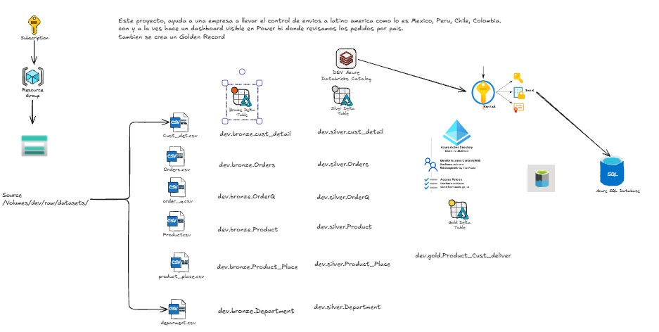
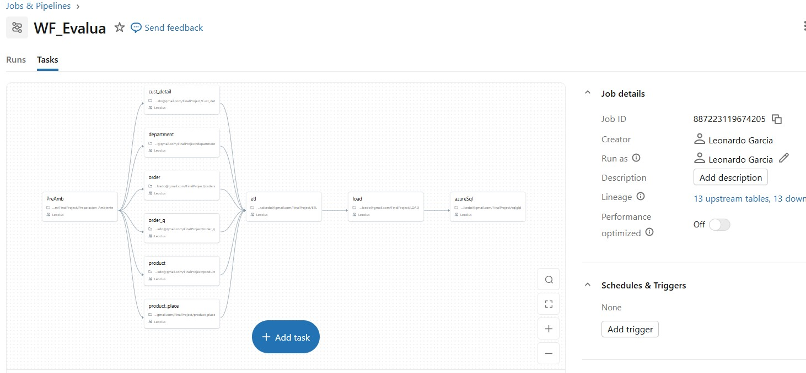
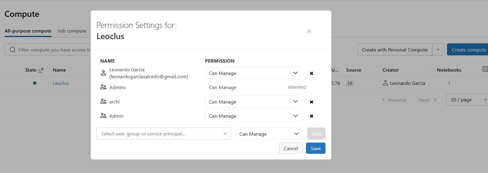
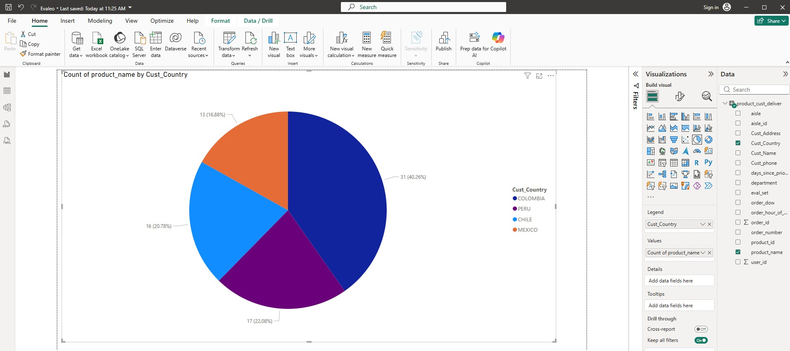
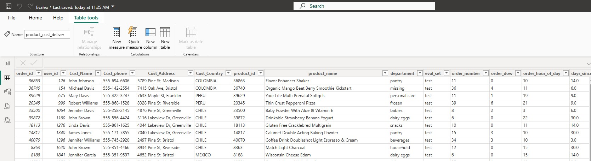

### **Tienda Online detalles de envios**

En este proyecto encontraremos la ejecucion de los detalles de envios y Productos comprados por paises Sudamericanos como lo es Colombia, Chile, Peru y Mexico.

Nuestra fuente esta compuesta de flat files csv delimitados por |.

Nuestras fuentes:

Cust_det.csv -. aqui encontraremos todos los detalles del cliente
deparment.csv -. en este archivo encontraremos en el departamento que se encuentra el product
Product.csv -. nos muestra el producto comprado
product_place.csv -. la ubicacion del producto dentro del departamento
order_q.csv -. este archivo contiene el orden de pedidos
Orders.csv .- aqui se encuentra la orden que fue tomada

estas fuentes se somenten a un tratamiento de limpieza de datos llegando como RAW Data

**### ✨ Aqui Comenzamos con una Arquitectura Medallion en Azure Databricks**
empezamos con Bronze donde traemos los datos RAW a nuestra DELTA table
despues hacemos una limpieza de datos y logicas aplicada demandadas por el negocio del ser requerido,
lo almacenamos en nuestra silver Delta table.
Por ultimo ponemos los datos mas significativos para el negocio en un Golden table del cual hacemos un dashboard 
con tecnologia Power BI para un merjor entendimiento y analisis por el negocio.

lo cual se muestra en el Diagrama de flujo 

✨ Características Principales
🔄 ETL Automatizado por Jobs & Pipelines.
mostrado en la imagen inferior

Para su envio entre ambientes usamos 🚀 CI/CD:

Usamos GitHub configurado con seguridad con access tokens entre DEV GITHUB y de GITHUB a PROD.

🔐 En Seguridad usamos Azure Key Vault en el cual se crearon secretos mostrados en nuestra primer imagen. ademas control Grants mediante el admin de azure creando grupos de accesos granulares segun su equipo ya sea Desarrolladores, Arquitectos o Administrador. 

📊 Grafico: para el mejor entendimiento de parte del negocio se construyo una conexion avanzada con Power BI a través de Delta Sharing.
## Power BI Dashboard

## Porwe BI data

## Creacion de GOLDEN data en tabla Azure

